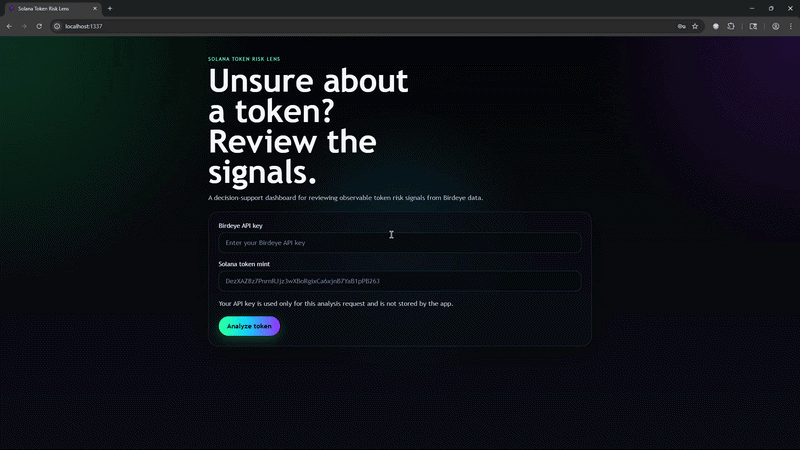

# Solana Token Risk Lens

## Overview

Solana Token Risk Lens is a Rust-powered security-oriented dashboard for reviewing observable token risk signals before interacting with a Solana token.

It is built as a decision-support tool, not a scam detector and not financial advice.

Short framing:

> A decision-support dashboard that uses Birdeye data to help Solana users identify early risk signals before interacting with a token.

## Problem

Solana users often discover tokens through social feeds, DEX dashboards, Telegram or Discord communities, and trend trackers. In fast-moving environments, it is easy to focus only on price while missing other important signals such as:

- weak liquidity;
- concentrated holder distribution;
- extreme recent price movement;
- limited public project context.

Price alone is not enough to understand observable token risk.

## Solution

This project takes a Birdeye API key and a Solana token mint, then generates an explainable report using:

- Birdeye Price;
- Birdeye Token Overview;
- Birdeye Token Holder.

The backend calculates:

- a 0–100 Risk Index;
- a risk level;
- per-component scoring breakdown;
- red flags;
- manual review prompts;
- data source status.

The React UI renders the report in a simple, demo-friendly format.

## What the report includes

- token name, symbol, price, and liquidity when available;
- a 0–100 Risk Index;
- a human-readable risk level;
- an overall summary;
- a score breakdown for:
  - holder concentration
  - liquidity
  - momentum
  - project context
- red flags;
- manual review checks;
- data source status;
- a clear disclaimer about limitations.

## Demo



Core flow:

1. Enter a Birdeye API key.
2. Enter a Solana token mint address.
3. Click `Analyze token`.
4. Review the risk report, breakdown, red flags, and manual checks.

Default local URLs:

- Frontend: `http://localhost:1337`
- Backend: `http://localhost:1984`

Suggested demo tokens for local testing:

- `So11111111111111111111111111111111111111112` for a high-liquidity baseline
- `DezXAZ8z7PnrnRJjz3wXBoRgixCa6xjnB7YaB1pPB263` for a token with more visible holder signals

## Features

- Rust backend with Axum
- React + Vite frontend
- Birdeye integration for price, overview, and holders
- Explainable 0–100 Risk Index
- Score breakdown for:
  - holder concentration
  - liquidity
  - momentum
  - project context
- Red flags and manual review checklist
- Graceful handling for partial upstream data
- API key is used per request and not stored by the app

## Architecture

- Rust + Axum backend handles Birdeye API integration, response normalization, and risk scoring.
- React + Vite frontend handles user input, request state, and report rendering.
- The frontend is intentionally thin. Core analysis logic lives in the Rust backend.

### Why Rust backend?

The core analysis pipeline is implemented in Rust to keep the data-fetching, normalization, scoring, and report generation logic explicit and reusable. The React frontend is intentionally thin and only renders the report returned by the backend.

## API key handling

- The Birdeye API key is entered by the user in the frontend.
- It is kept in frontend memory only for the current session flow.
- The key is sent in the POST request body for the current analysis.
- The app does not store the key in localStorage, a database, or query parameters.
- The backend does not return the API key in responses.

## How it works

Request flow:

```text
Birdeye API key
  -> token mint
  -> Rust backend
  -> Birdeye Price + Overview + Holders
  -> normalize data
  -> score components
  -> combine into Risk Index
  -> return structured report
  -> render in React UI
```

Current backend report includes:

- token metadata when available;
- risk index and risk level;
- summary;
- holder concentration metrics;
- risk breakdown;
- red flags;
- manual checks;
- data source status.

The frontend keeps the API key in component state only, sends it in the request body for the current analysis, and does not store it locally.

## Risk scoring model

The scoring model is heuristic. It is designed to make risk signals explainable, not to classify tokens as safe or malicious.

Risk Index range:

```text
0-25   Low observable risk
26-50  Moderate observable risk
51-75  High observable risk
76-100 Severe observable risk
```

Current component weights:

```text
Liquidity Risk              0-35
Holder Concentration Risk   0-30
Momentum / Volatility Risk  0-25
Project Context Risk        0-10
Total                       100
```

Interpretation:

- Higher score means higher observable risk based on available Birdeye signals.
- The score is meant to support manual review, not replace it.

## Setup

### Requirements

- Rust toolchain
- Node.js and npm
- Birdeye API key

### Backend

```bash
cd backend
cargo run
```

The backend listens on:

```text
http://localhost:1984
```

### Frontend

```bash
cd frontend
npm install
npm run dev
```

The frontend runs on:

```text
http://localhost:1337
```

### Notes

- The frontend sends the API key in the POST request body.
- The backend uses the key only for the current Birdeye request cycle.
- The key is not stored by the app.

## Quick start

1. Start the backend.
2. Start the frontend.
3. Open `http://localhost:1337`.
4. Paste a Birdeye API key.
5. Paste a Solana token mint.
6. Run the analysis and review the report.

## Known limitations

- Birdeye rate limits can affect multi-endpoint analysis.
- The current implementation uses a short delay between upstream requests as a practical workaround for burst-related `429` responses.
- Public project context is limited to what Birdeye returns.
- Holder concentration does not imply malicious intent; large wallets may be exchanges, liquidity pools, lockers, burn addresses, or treasury wallets.
- Some addresses may return partial data or missing metadata.
- Address validation is currently a lightweight format check, not full on-chain verification.

## Disclaimer

This tool does not label tokens as scam or safe.

It highlights observable risk signals from Birdeye data and helps users structure manual research.

Always verify project links, holders, liquidity, and token metadata manually before interacting with a token.

## Roadmap

- add optional Trades analysis for buy/sell imbalance and liquidity events;
- improve Solana token identity validation;
- add configurable Birdeye retry/backoff strategy;
- add optional CLI mode for security researchers;
- add JSON export for reports;
- improve holder classification for LPs, CEX wallets, lockers, burn addresses, and treasury wallets.